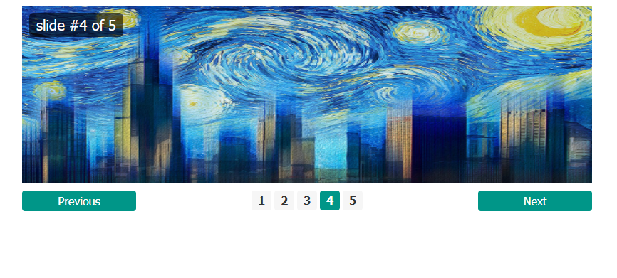

# Slider Project

## Overview
The Slider Project is a simple and interactive application that displays a series of sliders. Users can navigate through the sliders using **Next** and **Previous** buttons.

---

## How It Works

1. **Display Sliders**:
   - The project consists of **5 sliders**, each showing unique content (e.g., images, text, or a combination).

2. **Navigation Buttons**:
   - **Previous Button**: Click to navigate to the slider immediately before the current one.
   - **Next Button**: Click to navigate to the slider immediately after the current one.

3. **Looping Behavior**:
   - At the first slider, clicking the **Previous** button navigates to the last slider.
   - At the last slider, clicking the **Next** button navigates to the first slider.
---

## Features

- **Smooth Transitions**: Navigating between sliders includes smooth animations.
- **Dynamic Content**: Each slider can display different types of content, such as images, text, or interactive elements.
- **Looping Navigation**: Seamlessly loop through the sliders without hitting an endpoint.
- **Responsive Design**: The sliders are optimized for various screen sizes and devices.

---

## How to Use

1. **Start the Application**:
   - Open the slider project in your browser.

2. **Navigate Through Sliders**:
   - Use the **Next** button to move forward.
   - Use the **Previous** button to move backward.

3. **Experience Seamless Looping**:
   - Enjoy continuous navigation as the sliders loop from the end to the start or vice versa.

---

## Requirements
- A modern web browser.
- JavaScript enabled for interactivity.

---

## Future Enhancements

- **Autoplay**: Add an option for the sliders to transition automatically after a set interval.
- **Custom Content**: Allow users to upload or customize slider content.
- **Pagination Dots**: Add navigation dots below the slider for quick access to specific slides.
- **Swipe Support**: Enable touch gestures for mobile users.
- **Theming Options**: Provide themes to change the appearance of the sliders.

---

Enjoy the simplicity and elegance of this interactive Slider Project!

