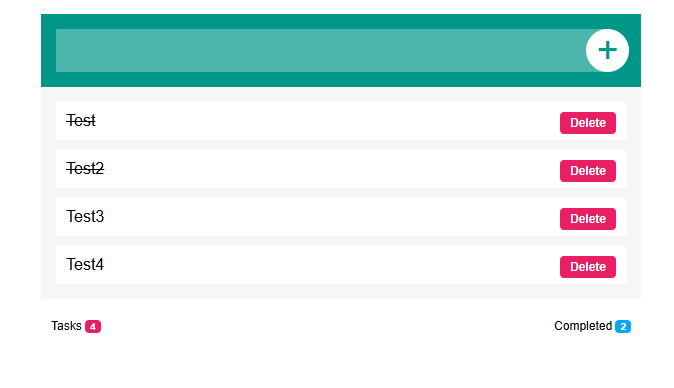

# To-Do List Application

## Overview
The To-Do List Application is a simple and intuitive tool to help you manage your daily tasks. You can add tasks, mark them as completed, unmark them, and delete them as needed. The application also provides real-time counters to track your progress.

---

## How It Works

1. **Add Tasks**:
   - Type the task you want to add in the input box.
   - Click the **Add** button to add the task to the list.

2. **Mark Tasks as Completed**:
   - Click on a task to mark it as **completed**. Completed tasks are visually distinguished (e.g., struck through or highlighted).
   - Click on a completed task again to unmark it if it’s no longer completed.

3. **Delete Tasks**:
   - Click the **Delete** button next to a task to remove it from the list.

4. **Track Progress**:
   - **Total Tasks Counter**: Displays the total number of tasks in the list.
   - **Completed Tasks Counter**: Displays the number of tasks marked as completed.

---

## Features

- **Task Management**: Add, delete, and toggle task completion status with ease.
- **Real-Time Counters**:
  - Tracks the total number of tasks.
  - Tracks the number of completed tasks.
- **Interactive UI**: Clicking on tasks toggles their completion status.
- **Dynamic Updates**: Counters update automatically as tasks are added, deleted, or toggled.

---

## How to Use

1. **Add a Task**:
   - Enter the task in the input box.
   - Click the **Add** button.

2. **Mark or Unmark a Task**:
   - Click on a task to mark it as completed.
   - Click again to unmark it.

3. **Delete a Task**:
   - Click the **Delete** button next to the task you want to remove.

4. **Monitor Progress**:
   - View the total number of tasks and the number of completed tasks at the bottom of the list.
   
---

## Requirements
- A modern web browser.
- JavaScript enabled for interactivity.

---

## Future Enhancements

- **Categories**: Allow tasks to be grouped into categories (e.g., Work, Personal).
- **Search Functionality**: Add a search bar to filter tasks by keywords.
- **Due Dates**: Allow tasks to have optional due dates.
- **Drag-and-Drop Reordering**: Enable tasks to be rearranged manually.
- **Persistent Storage**: Save tasks locally using browser storage or integrate with a database.

---

Stay organized and boost your productivity with this To-Do List Application!

